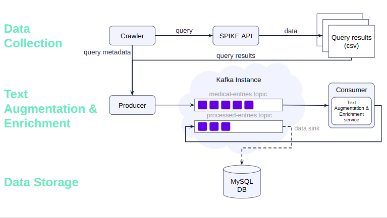

# Kafka Pipeline - Medical Text Mining

## Project Overview  

This project simulates a real-time data pipeline using Apache Kafka, Python, Spacy, and MySQL. It models a scenario where medical entries about medical threatment are generated, processed to extract key information (illness and medicine), and then stored in MySQL.

The pipeline builds upon an existing NLP project developed as part of the NLP course I took during my Master’s degree ([NLP-4](https://github.com/mhornstein/NLP-4)). That project focused on medical information extraction using natural language processing methods. In this new project, the goal was to automate and scale the process by integrating Apache Kafka, enabling real-time, scalable data processing. This approach allowed me to explore Kafka's capabilities in-depth.  

## Architecture  

The following diagram provides an overview of the system architecture from both business and technical perspectives:  

  

1. **Data collection**  
   Data is collected by executing queries against the **SPIKE API**. For more information about this API, refer to the research paper: [Interactive Extractive Search over Biomedical Data](https://www.semanticscholar.org/paper/Interactive-Extractive-Search-over-Biomedical-Taub-Tabib-Shlain/e673f54c4005931fd3392bbf95c80a9f5024d5c4).   

2. **Text Augmentation & Enrichment**  
   The retrieved data is processed to extract the required information, i.e. illnesses and medicines. This process uses metadata from the queries to apply heuristic-based extraction methods. Detailed methods and evaluations can be found on pages 5–11 of the original [project report](https://github.com/mhornstein/NLP-4/blob/main/report.pdf). Kafka topics are used to manage the flow of raw data and processed results.  

3. **Data Storage**  
   Processed results are stored in a MySQL database using Kafka's Sink Connector (This connector simplifies data integration by automating the transfer of Kafka topic data into relational database tables).

## Platform

- **Kafka Consumers/Producer**: Runs on Windows 10 with Python 3.10.8
- **Kafka Platform and MySQL**: Runs on Ubuntu via WSL (Windows Subsystem for Linux)

## Installation

### 1. Install WSL 2 on Windows

1. **Download and Install WSL 2:**
   Follow the official [WSL installation guide](https://docs.microsoft.com/en-us/windows/wsl/install) to install WSL 2 on your Windows machine.

2. **Verify Installation:**
   - Open Command Prompt or PowerShell and run:
     ```bash
     wsl --list --verbose
     ```
   - If Ubuntu is not listed, install it by running:
     ```bash
     wsl --install -d Ubuntu
     ```
   - Set Ubuntu as the default distribution:
     ```bash
     wsl --set-default Ubuntu
     ```

3. **Start WSL:**
   Run `wsl` in Command Prompt or PowerShell to start the WSL environment.

### 2. Set Up MySQL DB and Confluent Platform on Ubuntu

This is done using the `setup_confluent_platform.sh` Script.
This script installs and configures MySQL DB and Confluent Platform 7.7.0 on Ubuntu, including:
- Starting MySQL, creating a user, and setting up the database.
- Starting Zookeeper, Kafka server, Schema Registry, and Kafka Connect services.
- Creating Kafka topics with Avro schemas.
- Configuring and deploying a Kafka Sink Connector to MySQL.
- Inserting a test entry into Kafka topics to validate the setup.

At the end, the script provides instructions for:
- Verifying data insertion in MySQL.
- Determining the IP address needed to connect to Kafka from Kafka producer and consumer clients.

1. **Create and Edit the Setup Script:**
   - Navigate to your home directory:
     ```bash
     cd ~
     ```
   - Create and edit the script `setup_confluent_platform.sh`:
     ```bash
     nano setup_confluent_platform.sh
     ```
   - Copy the content from the GitHub repository (`scripts\setup_confluent_platform.sh`) into the file.
   - Save and exit by pressing `Ctrl+X`, then `Y` to confirm, and `Enter` to exit.

2. **Make the Script Executable:**
   ```bash
   chmod +x setup_confluent_platform.sh
   ```

3. **Run the Script:**
   Start the services by running:
   ```bash
   ./setup_confluent_platform.sh
   ```
   Wait for the script to complete. At the end, the IP address of the server will be displayed.

### 3. Run Producer and Consumer on Windows
Make sure Kafka is installed on your Windows machine. then: 

1. **Update Configuration:**
   - In `src/config.yaml`, update the `server_url` entry with the IP address provided by the script in the previous step. For example:
    `server_url: '172.28.60.217'`

2. **Run the Producer and Consumer:**
   - Execute the `start_kafka_producer_consumer.bat` script.

The producer will output the entries it produces, and the consumer will display the entries it consumes. Periodically check the MySQL table for updates.

- **output placeholder**
